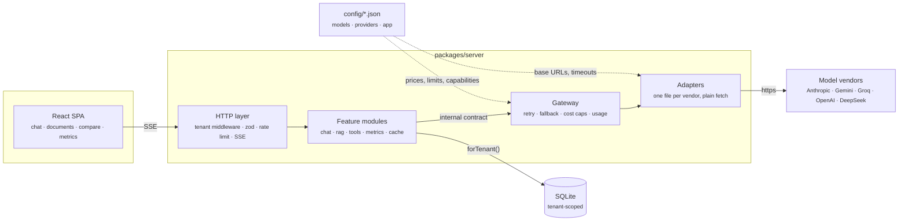
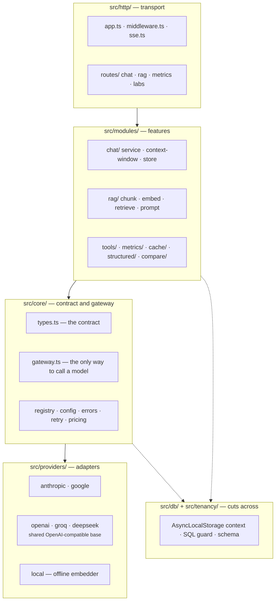
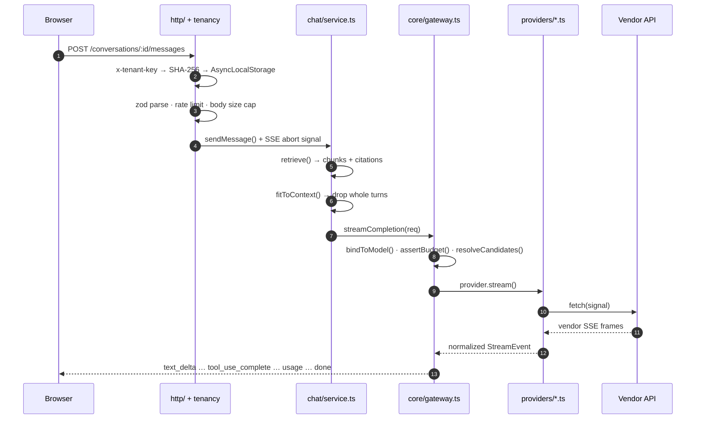
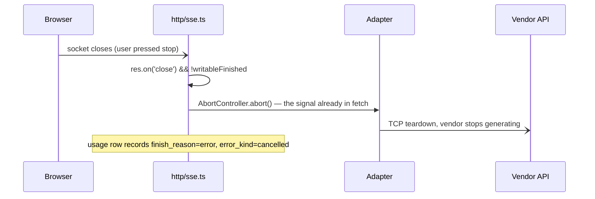
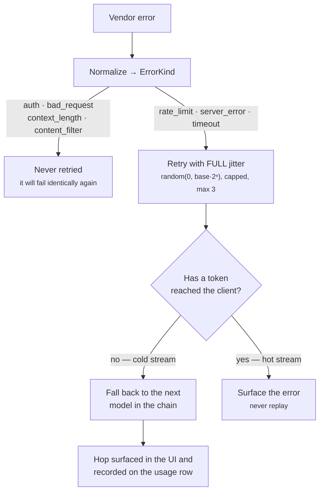
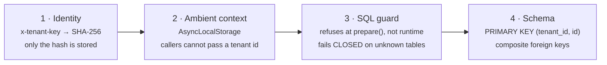
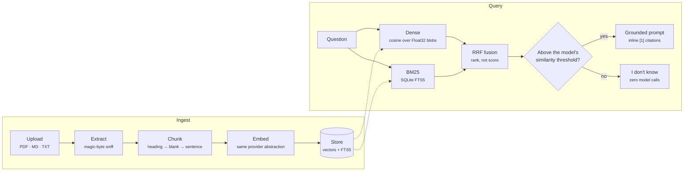

# Architecture

HLD, LLD, the request lifecycle, the tenant boundary, and a proposed AWS topology —
in one place, so the shape of the system can be read without reading the code first.

`docs/DESIGN.md` is the decision record: what was chosen, what was rejected, and why.
This document is the map. Where the two overlap, DESIGN.md is the authority.

> **Deployment status.** Polyglot is not currently deployed on AWS. It ships as a
> single container and runs locally (`npm run dev`, or `docker compose up`). §7 is a
> *target* topology and the reasoning behind it, not a description of running
> infrastructure.

**Contents** — [1 System context](#1-system-context) · [2 Module map](#2-module-map) ·
[3 Request lifecycle](#3-request-lifecycle) · [4 Provider abstraction](#4-provider-abstraction) ·
[5 Retry and fallback](#5-retry-and-fallback) · [6 Tenant isolation](#6-tenant-isolation) ·
[7 RAG pipeline](#7-rag-pipeline) · [8 AWS topology](#8-aws-topology)

---

## 1. System context

Five vendors whose APIs genuinely disagree, reduced to one contract. Everything above
the adapter layer speaks only `src/core/types.ts`; no vendor shape, vendor error or
vendor SSE frame is allowed to escape `src/providers/`.



Arrows only ever point toward the vendor. Nothing to the right of the gateway knows a
tenant exists, and nothing to its left knows a vendor does.

---

## 2. Module map

Four layers, each depending only downward, plus a data/tenancy concern that cuts across
all of them. The rule is enforced by tests, not by discipline: no file outside
`src/providers/` may branch on a provider name, and the registry's provider list must
equal the `*.provider.ts` files on disk.



**Why the layering is worth defending.** The gateway is the single choke point for every
model call — chat, context summarisation, structured extraction and side-by-side
comparison all enter through `streamCompletion()` or `complete()`. That is what makes
cost caps, cancellation and usage accounting impossible to forget: there is nowhere else
to call a provider from.

---

## 3. Request lifecycle

One streaming turn with retrieval and tools enabled.



Cancellation runs the same path backwards:



**Why the abort listens on the response, not the request.** For a POST whose body has
been fully read — every JSON route and every multipart upload, because the body parser
drains it before the handler runs — Node fires `close` on the `IncomingMessage`
microseconds after the handler starts. Deriving the signal from `req.on('close')`
therefore aborts every request on its first line. That bug shipped once here, in three
routes, and is now pinned by a test that boots the real app and hangs up mid-stream.

---

## 4. Provider abstraction

One interface, implemented once per vendor:

```ts
interface Provider {
  readonly name: string
  complete(req: CompletionRequest): Promise<CompletionResponse>
  stream(req: CompletionRequest): AsyncIterable<StreamEvent>
  embed?(req: EmbeddingRequest): Promise<EmbeddingResponse>
}
```

Divergence is absorbed through exactly two narrow escape hatches, both of which keep
vendor knowledge inside the adapter:

| What diverges | How it fails | Where it is absorbed |
|---|---|---|
| **Gemini 3 `thought_signature`** | The vendor mints an opaque token on each `functionCall` and rejects the turn that replays it without one. The *first* leg of a tool turn succeeds and the second 400s — invisible until a model actually asks for a tool. | `ContentBlock.providerMetadata`, namespaced by provider so a conversation that switches vendor mid-thread cannot hand Google's token to Anthropic. |
| **`temperature` deprecated per model** | Claude Sonnet 5 and Opus 5 hard-400 on `temperature`; Haiku 4.5, Sonnet 4.5 and Opus 4.5 accept it through the *same adapter*. A vendor-level flag cannot express this. | A per-model capability in `config/models.json` that the gateway strips in `bindToModel()` — on every hop, so a fallback onto a stricter model does not resurrect the 400. |
| **Gemini correlates tool results by name** | Anthropic and OpenAI correlate by id. Gemini's `functionResponse` carries a `name`; get it wrong and results attach to the wrong tool with no error anywhere. | `toGeminiContents()` builds an id → name index from history and recovers the name from the originating `tool_use`. |

Adding a sixth provider is one new file in `src/providers/` plus an entry in
`providers.json` and one in `models.json`. See `docs/DESIGN.md` §3 for the exact code.

---

## 5. Retry and fallback

The decision that matters is *when it is still safe to retry*. Once a single token has
reached the browser the request is committed — replaying it would duplicate output, and
buffering the whole response so it *could* be replayed is fake streaming with extra
memory.



Full jitter rather than ±10%: with a fallback chain and several tenants, correlated
retries are the failure mode that turns one provider blip into a self-inflicted
thundering herd. `Retry-After` is honoured when the vendor sends it, capped so one
vendor's "try again in 6 minutes" cannot pin a request open past its own timeout.

Chains cross vendors on purpose — a same-vendor hop does not survive the outage that
motivates having a chain at all.

---

## 6. Tenant isolation

The brief's real question: *a new engineer joins on Monday and writes a query — what
stops them leaking data?* The answer has to be structural, not a review convention.



Monday morning, concretely:

```sql
-- what a new engineer writes
SELECT * FROM documents WHERE id = ?
```

```
AppError: tenant_predicate_missing
  Refusing to run a query over tenant data: statement must filter on
  "tenant_id = :tenant_id" (one predicate per tenant-scoped table).
  → docs/DESIGN.md "Tenant isolation". Use db.forTenant().prepare(...)
```

It throws the first time it runs, in dev, naming the predicate to add — not in a code
review, and not in production.

**What it still cannot catch:** a query carrying a correct predicate but the wrong tenant
id, and anything written outside `forTenant()` through a raw handle. The audit log and
per-tenant usage rows are how a leak would be *detected*; the guard is prevention, not
proof. SQLite has no row-level security, which is why §8 moves this into Postgres RLS.

---

## 7. RAG pipeline



**Why RRF rather than a weighted score blend.** A dense cosine score and a BM25 score are
not on the same scale and never will be, so any weighting is a magic number that drifts.
Reciprocal rank fusion uses only each list's *ordering*, which is the part both
retrievers agree about.

**Why the threshold lives on the model.** Cosine scores are not comparable across
embedding models: the same relevant query/passage pair scores ~0.73 on
`gemini-embedding-2` and ~0.40 on the local hashed embedder. A collection therefore pins
its embedding model at creation — mixing vector widths produces meaningless similarity
with no error anywhere.

Retrieved text is fenced and defused before it reaches the prompt: a document that says
"ignore all previous instructions" is treated as data, not as an instruction.

---

## 8. AWS topology

**Proposed**, not deployed — see the note at the top of this file. This is where the
take-home's documented cuts get paid off.


Three constraints drive this shape:

1. **The ALB must not buffer responses**, and its idle timeout must exceed the longest
   stream — otherwise SSE degrades into exactly the fake streaming the brief forbids.
2. **Fargate tasks are stateless**, so every piece of state SQLite holds today has to
   move to Aurora, ElastiCache or S3.
3. **Provider keys come from Secrets Manager at boot**, never baked into the image.

### What changes from today, and why

| Today | In production | Reason |
|---|---|---|
| SQLite file + SQL guard | Aurora PostgreSQL + row-level security | The guard is a conservative lexical check because SQLite has no RLS. Postgres enforces the predicate in the engine, where it cannot be forgotten. |
| Brute-force cosine over Float32 blobs | pgvector index | Exact and index-free is right at this scale; it is O(n) and stops being right around 10⁵ chunks per collection. `VectorStore` is an interface for exactly this swap. |
| In-memory token bucket | ElastiCache (Redis) | Correct for one process, wrong for several — and Fargate runs N ≥ 2. Also the natural home for the semantic cache, which is per-process today. |
| Synchronous ingest, buffers in memory | S3 originals + a job queue | Ingestion is synchronous so failures stay visible during a walkthrough. At volume that belongs on a queue, with the original retained for re-indexing. |
| `.env` on disk | Secrets Manager → task env | Keys never enter the image or the repo, and rotation stops being a redeploy. |
| Structured JSON logs to stdout | CloudWatch metrics + alarms | The usage table already carries TTFT, cost, finish reason, retry count and fallback origin per request. Those are the alarm signals: cost per tenant per day, fallback rate, p95 TTFT. |

---

Icons in the topology diagram are the official
[AWS Architecture Icons](https://aws.amazon.com/architecture/icons/)
(`Icon-Architecture/48/Arch_*`), embedded as inline SVG.
AWS and the AWS icons are trademarks of Amazon Web Services, Inc.
