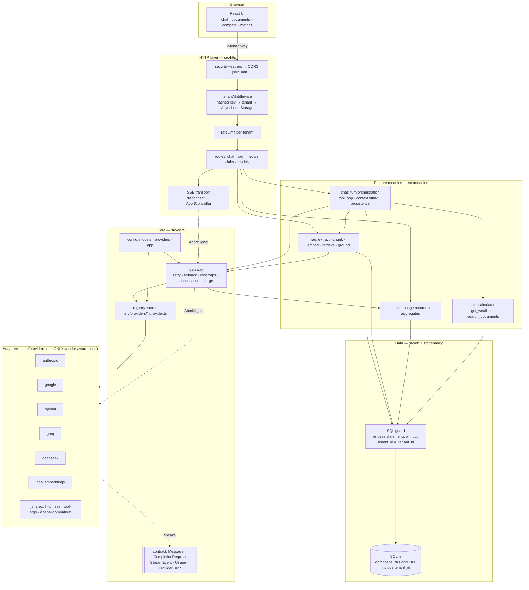
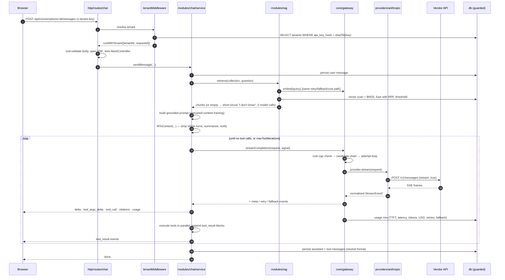

# Polyglot — design

## 1. Shape of the system



The one rule that keeps this honest: **nothing above `src/providers/` may know a
vendor exists.** A test enforces it (`test/gateway.test.ts` → "has no file that
enumerates provider names"): no file outside the adapters directory may branch on
a provider name. When that test fails, the abstraction has started leaking.

---

## 2. A request end to end

A streamed chat turn with RAG and tools — the longest path in the system.



**Cancellation.** The browser aborts its `fetch` → the socket closes → Express
raises `close` on the *response* → we abort the `AbortController` → that signal
is already merged into the adapter's `fetch` call → the upstream connection is
torn down. Verified against a mock upstream: the provider stops generating at
exactly the token the client stopped receiving.

---

## 3. The provider abstraction

### Layering

```
core/types.ts        the contract. Nothing vendor-shaped, ever.
core/registry.ts     name → factory. Scans the directory; no index file.
core/gateway.ts      the only caller of a Provider. Owns retry/fallback/cost/usage.
providers/*.provider.ts   one file per vendor. Self-registers at module load.
providers/_shared/   http (timeout + abort + error normalization), sse parser,
                     tool-argument accumulator, OpenAI-compatible base class.
```

`_shared/openai-compatible.ts` is what makes OpenAI, Groq and DeepSeek a dozen
lines each: their differences are *data* (`CompatQuirks`), not files. It is
deliberately **not** the base for Anthropic or Gemini. Forcing those two into an
OpenAI-shaped hierarchy is exactly the move this assignment is designed to catch:
their divergences are structural (no tool role; `parts[]` instead of `content[]`;
a different schema dialect), not parametric.

### Exactly what you would write to add a provider

The brief asks for "one new file and one config entry". This is one new file and
two config *files* — `providers.json` (how to reach the vendor) and `models.json`
(what it offers and what it costs). Both are pure data with no code in them, and
they are separate because a provider's transport outlives any particular model:
Gemini 2.5 was retired out from under this repo while it was being written, and
that was a `models.json` edit with `providers.json` untouched. Say Mistral.

**One file:**

```ts
// packages/server/src/providers/mistral.provider.ts
import { registerProvider } from '../core/registry.js';
import { OpenAICompatibleProvider } from './_shared/openai-compatible.js';
import type { ProviderInit } from '../core/types.js';

class MistralProvider extends OpenAICompatibleProvider {
  constructor(init: ProviderInit) {
    super(init, {
      // Wire-format quirks that are true of the VENDOR, not of one model.
      supportsStreamOptions: true,
      supportsJsonSchema: false,   // json_object only
      supportsParallelToolCalls: true,
      supportsEmbeddings: true,
    });
  }
}

registerProvider('mistral', (init) => new MistralProvider(init));
```

**Two config entries:**

```jsonc
// config/providers.json — transport only
"mistral": {
  "baseUrl": "https://api.mistral.ai/v1",
  "apiKeyEnv": "MISTRAL_API_KEY",
  "timeoutMs": 120000,
  "options": {}
}

// config/models.json
"mistral:mistral-large-latest": {
  "provider": "mistral",
  "providerModelId": "mistral-large-latest",
  "kind": "chat",
  "contextWindow": 131072,
  "maxOutputTokens": 8192,
  // Per-MODEL capabilities. `temperature: false` would make the gateway strip
  // the parameter for this model only; omit it and the model accepts one.
  "capabilities": { "tools": true, "vision": false, "jsonSchema": false, "streaming": true },
  "pricing": { "inputPerMTok": 2.0, "outputPerMTok": 6.0 }
}
```

Note the division: anything that varies *per model* belongs in `models.json`,
and only genuine wire-format quirks go in the adapter's constructor. Putting a
capability in both would be a trap, because the constructor argument is spread
last and would silently win over the config it appears to duplicate.

That is the entire change. No index file, no switch, no DI registration, no UI
edit — the model picker, metrics, fallback chains and cost accounting all read
from config. For a provider whose wire format is genuinely different (a Cohere or
a Bedrock), the file is longer because it implements `Provider` directly instead
of extending the compatible base, but it is still exactly one file.

Two tests keep this true rather than aspirational:

- the registry's provider list must equal the `*.provider.ts` files on disk;
- no file outside `src/providers/` may branch on a provider name.

### Deltas from the brief's contract

Everything in the sketch is implemented as written. Three additions, each because
leaving it out would have forced a vendor detail upward:

| Addition | Why |
|---|---|
| `reasoning_delta` stream event | DeepSeek's `reasoning_content` and Gemini's thought parts arrive on a separate channel. Folding them into `text_delta` would corrupt the assistant turn we persist and replay — and DeepSeek 400s if you echo reasoning back. It is stored in its own column for the same reason. |
| `ErrorKind: 'unsupported' \| 'cancelled'` | "This model has no tool calling" and "the user pressed stop" are not `bad_request`. Both need distinct UI and distinct retry semantics. |
| `Usage.cacheWriteTokens`, `CompletionResponse.structuredMode` | Anthropic bills cache *writes* at a premium, so cost needs the bucket. `structuredMode` reports which mechanism actually enforced a schema, since one of the four does not enforce at all. |

One normalization is worth calling out because it is where cost bugs live:
**`Usage.inputTokens` is always the total prompt size, and the cache counters are
subsets of it.** Anthropic does not report it that way — its `input_tokens`
*excludes* both cache buckets — so `anthropic.provider.ts` adds them before the
usage leaves the adapter. Doing it there rather than in the pricing layer is why
`core/pricing.ts` has no vendor branch, and why the next person to write an
adapter gets the rule from the type instead of from tribal memory.

---

## 4. Tenant isolation

> Collections, documents, conversations and usage records belong to a tenant. A
> user from Tenant A must never retrieve, cite, see, or be billed for anything
> belonging to Tenant B.

The goal was for the boundary to be **structurally true**: a leak should require
defeating the database, not merely forgetting a `WHERE` clause.

### 4.1 Where does the tenant identifier come from, and can a caller forge it?

From a **secret**, not an identifier. The request carries `x-tenant-key`, an
opaque random key. The server hashes it and looks up the tenant. Only the
SHA-256 is stored, so a database dump does not yield working credentials for
every tenant.

**It cannot be forged**, because there is nothing to forge: no `X-Tenant-Id`
header exists anywhere in the request path, and sending one has no effect. There
is no code path that reads a tenant id from a request body, query string or
client-supplied field. Failed lookups are logged (never the key) — repeated
failures are the first signal of credential stuffing.

For a take-home this stands in for auth, as the brief allows. In production the
same seam takes a verified JWT or session and reads the tenant claim from it. The
property that matters is unchanged: **everything downstream reads the tenant from
ambient context, never from anything the caller sent.**

### 4.2 Where is the boundary actually enforced?

Four independent layers. The point of layering is that none of them has to be
perfect.

**(a) Ambient context, not a parameter.** `runWithTenant()` puts the tenant in
`AsyncLocalStorage`. The data layer reads it from there and *refuses to run*
without it. There is no `tenantId?: string` parameter for someone to forget,
default or shadow six months from now. Forgetting produces a loud 500 on the
first request in dev, not a silent leak in production.

**(b) A SQL guard at statement preparation.** SQLite has no row-level security,
so the equivalent goes in the one place every query must pass through.
`src/tenancy/guard.ts` inspects each statement *before it compiles*:

- every tenant-scoped table it touches must be pinned by `tenant_id = :tenant_id`
  (or correlated, `a.tenant_id = b.tenant_id`, which is equally safe because one
  side is already pinned) — and a join must pin *every* tenant table, not just the
  outer one;
- an `INSERT` must include a `tenant_id` column bound to that parameter;
- the framework binds `:tenant_id` itself; a caller who tries to bind it by hand
  gets `tenant_param_override`;
- it **fails closed**: a table classified neither tenant-scoped nor global is
  rejected outright, so the guard cannot silently stop covering tables added after
  it was written.

It is a conservative lexical check, not a SQL parser — string literals and
comments are stripped first, and anything it cannot understand is refused. False
positives cost a developer thirty seconds; a false negative costs a customer
their data.

**(c) The schema itself.** Every primary key is `(tenant_id, id)` and every
foreign key is composite and includes `tenant_id`:

```sql
FOREIGN KEY (tenant_id, conversation_id) REFERENCES conversations(tenant_id, id)
```

So ids are unique only *within* a tenant, a stray `WHERE id = ?` cannot match
another tenant's row, and inserting a message into another tenant's conversation
is rejected by SQLite with no application code involved. There is a test that
does exactly that, with the application deliberately wrong, and asserts the
database refuses it.

**(d) Two doors, both guarded.** The raw connection handle is module-private.
`globalDb()` may touch only tables classified global; `forTenant()` is the only
way to reach tenant data. "I'll just use the raw connection for this one query"
is not a shortcut that exists.

### 4.3 A new engineer joins on Monday and writes a query. What stops them?

They write the natural thing:

```ts
forTenant().prepare('SELECT * FROM documents WHERE id = :id');
```

It throws immediately, in dev, on the first run:

```
tenant_predicate_missing: Refusing to run a query over tenant data:
statement must filter on "tenant_id = :tenant_id" (one predicate per tenant-scoped table).
  tables: ["documents"]
  help: docs/DESIGN.md → "Tenant isolation". Use db.forTenant().prepare(...) and reference :tenant_id.
```

If they work around the guard, the composite foreign keys still refuse
cross-tenant writes. If they add a new table and forget to classify it, the guard
rejects every statement touching it until they do. If they write it in a code
path with no request context, `currentTenant()` throws. The failure is loud,
immediate, and carries the fix.

What this does **not** catch, stated plainly: a deliberate `tenant_id = 'ten_x'`
literal in a string (the guard requires the bound parameter, so this is refused —
but a sufficiently creative dynamic query could still confuse a lexical check), a
bug inside a tenant's own scope, or anyone with filesystem access to the SQLite
file. Those are the reasons for layer (c) and for §4.4.

### 4.4 How would you know, in production, if it had ever leaked?

- **Structured logs.** Every line carries `tenantId` and `requestId`. A leak
  investigation is a query, not an archaeology project.
- **`audit_log`.** Tenant-scoped, and itself subject to the guard. Records what
  was created, read and deleted, per request.
- **Guard violations are recorded with `severity='violation'`** and surfaced in
  the Metrics tab. A single one in production is a page-worthy event: it means
  code reached the data layer without a tenant predicate.
- **Usage rows are per tenant**, so "Tenant A was billed for Tenant B's tokens"
  shows up in the cost aggregate rather than at renewal.
- **Tests as canaries.** Both seeded tenants hold a document containing a distinct
  secret string; the suite asserts each is unreachable from the other. In
  production these would run continuously as synthetic checks against staging.

What is missing before production: alerting on `severity='violation'`, a nightly
cross-tenant reconciliation job (`SELECT` every FK pair where tenant ids differ —
should always be empty), and per-tenant encryption keys so a filesystem leak does
not yield plaintext across tenants.

### 4.5 Migration to Postgres RLS

SQLite cannot do RLS, so the guard is the closest structural equivalent. On
Postgres the same model becomes native and *stronger*, because it no longer
depends on the application asking nicely:

```sql
ALTER TABLE documents ENABLE ROW LEVEL SECURITY;
CREATE POLICY tenant_isolation ON documents
  USING (tenant_id = current_setting('app.tenant_id')::text);
```

with `SET LOCAL app.tenant_id = $1` issued by the same middleware that today
populates the `AsyncLocalStorage` context. The guard stays as a dev-time lint
(it catches the missing predicate at prepare time, with a better error than an
empty result set), the composite foreign keys stay as-is, and no feature module
changes at all — which is the point of having the data layer behind one door.

---

## 5. Security posture

### What I protected against

**Secrets.** `.env` gitignored, `.env.example` shipped, no key in the repo or in
any log. The logger redacts secret-looking keys and the literal key shapes of all
five vendors (`sk-`, `sk-ant-`, `AIza`, `gsk_`, `pk_`). `/api/models` reports
availability as a boolean and never names the env var behind it.

**Provider errors never leak.** `ProviderError` keeps the raw upstream body for
server-side logs, and `toClient()` deliberately drops it. Upstream error bodies
routinely echo the request, and have been known to include a key prefix. A test
asserts the client-facing shape has exactly four fields.

**Untrusted document content.** The one that matters most, because anyone who can
upload a document can try to retarget the model. Layered, and none of these is
claimed to be complete:

1. Chunks are wrapped in explicit delimiters, and the system prompt states
   *before* the data that everything inside is third-party content to be quoted,
   never obeyed.
2. Delimiter forgery is neutralized, so a document cannot close its own block and
   continue "as" the system.
3. Instruction-shaped spans ("ignore previous instructions", "system prompt:")
   are **annotated inline, not deleted** — deleting would lie to the user about
   what their document says. The turn emits an `injection_flagged` notice and
   writes an audit row.
4. Zero-width, bidi-override and control characters are stripped at ingest, so an
   instruction cannot be hidden from the human reading the same PDF.
5. **Least privilege is the real boundary.** `search_documents` does not take a
   collection parameter — it reads the conversation's collection, which came from
   a tenant-scoped query. Every tool is read-only and tenant-scoped, so a
   successful injection still cannot cross a tenant or mutate anything.

**Uploads.** Magic-byte sniffing decides the type; the declared `Content-Type` is
a hint, and a text file claiming to be a PDF is refused. Held in memory, never
written to disk, so path traversal, symlinks and leftover temp files are not
classes of bug that exist here. Size, count and part limits enforced by multer
*and* re-checked in ingestion. Filenames sanitized for display.

**No `eval`, and no `eval` in disguise.** The calculator is a tokenizer plus a
recursive-descent parser over a closed grammar — no identifier lookup, no property
access, no call into anything the parser did not define. `new Function`, a
sandboxed `vm` and regex-allowlist-then-eval are all rejected for the same reason:
they end in an interpreter that was not designed to be one. Input length, token
count, nesting depth and exponent magnitude are bounded, because a model can call
this in a loop. Eleven escape attempts are in the test suite.

**No SSRF surface.** Tool endpoints come from config; only typed, range-checked
values are interpolated. `get_weather` geocodes through *our* endpoint and passes
*our* coordinates — the model never influences a URL. Images are base64 only; we
never ask a provider to fetch a URL on our behalf.

**Input validation.** Every request body is parsed by a zod schema before reaching
a module; unknown keys are stripped rather than passed through. Path parameters
are narrowed in one place. Body size, upload size, prompt length, message count,
tool iterations and collection/document counts are all capped from config.

**Cost as an attack surface.** A prompt-injected document that induces a tool loop
is a billing incident. Bounded by per-request worst-case cost caps, a per-tenant
daily budget, a tool-iteration limit, and per-request timeouts.

**Transport.** Strict security headers, an explicit CORS allow-list (never a
reflected wildcard — the tenant key is a bearer credential), no `x-powered-by`,
ETags disabled.

### What I consciously left out for a take-home

- **Real auth** — no user identity, sessions, MFA, or key rotation. The tenant key
  is long-lived and shown once at seed time.
- **Distributed rate limiting** — in-memory, so correct for one process only.
- **Encryption at rest** — the SQLite file is plaintext. Document content is the
  sensitive asset here.
- **CSRF** — not applicable to a header-authenticated API, but a cookie-based
  production version would need it.
- **Per-tenant key isolation** for provider credentials — one set of keys serves
  all tenants; an enterprise deployment would want bring-your-own-key.
- **Dependency and container scanning, SBOM, signed releases.**
- **PII detection and redaction** before text reaches a third-party provider.

### What I would add before production

1. **Postgres with RLS** (§4.5) — the boundary should not depend on the
   application asking nicely.
2. **Alerting on guard violations and on cross-tenant reconciliation**, plus a
   nightly job asserting no FK pair spans two tenants.
3. **Per-tenant provider keys and per-tenant budgets** enforced at the gateway,
   with a hard circuit breaker rather than a soft cap.
4. **A prompt-injection evaluation suite** run in CI against the grounded prompt,
   because the defences in §5 are partial by nature and will regress silently.
5. **Secrets from a manager** (Vault/KMS) with rotation, not environment variables.

---

## 6. Decision log

**1. Plain `fetch` for every provider, no vendor SDKs.**
Chose: one HTTP path, one SSE parser, full visibility into the wire.
Rejected: official SDKs. They are allowed and are the right call in most
production codebases, but they would have hidden precisely what this assignment
asks me to demonstrate — and four SDKs disagree about cancellation, retry and
streaming in ways that leak into the abstraction anyway.
Cost: I own the SSE edge cases. They are tested.

**2. Directory-scanning registry instead of an index file.**
Chose: adapters self-register; the registry globs `*.provider.ts`.
Rejected: a hand-maintained `index.ts` map. It is more explicit and it is also
exactly the file that makes "adding a provider is one file" false.
Cost: dynamic import, so a typo in a filename is a runtime discovery. The test
asserting registry-equals-disk covers it.

**3. A shared OpenAI-compatible base for three providers — and not for the other two.**
Chose: quirks as data for OpenAI/Groq/DeepSeek; Anthropic and Gemini implement
`Provider` directly.
Rejected: one base class for all five. Their divergences are structural, not
parametric, and the abstraction would have leaked upward within a week.

**4. SQLite with a SQL guard, rather than Postgres.**
Chose: zero-setup review experience, and a guard that makes the boundary explicit
and testable.
Rejected: Postgres + RLS, which is strictly better for isolation but costs the
reviewer a container and a migration step before anything runs. Documented the
migration instead of pretending SQLite has RLS.
Cost: no RLS; the guard is a lexical check that fails closed.

**5. Brute-force vector scan behind a `VectorStore` interface.**
Chose: exact search over normalized Float32 blobs in the same transactional store
as everything else.
Rejected: pgvector/Qdrant/LanceDB — a second system to run, seed and keep
consistent, for a corpus where an exact scan is single-digit milliseconds.
Cost: O(n). Wrong somewhere above ~10^5 chunks per collection, which is why the
interface exists now rather than later.

**6. Hybrid retrieval fused with RRF, not a weighted score blend.**
Chose: rank-based fusion, because a cosine of 0.42 and a BM25 of −7.3 share no
scale and any weighting is tuned to one corpus.
Rejected: normalize-and-weight (brittle), and dense-only (misses exact
identifiers, product codes, section numbers — the things enterprise documents are
full of).

**7. Per-embedding-model similarity thresholds.**
Chose: the threshold lives on the model in config, overridable per request.
Rejected: one global threshold. A relevant pair scores ~0.35 on
`text-embedding-3-small`, ~0.7 on `gemini-embedding-001` and ~0.15 on the local
hashed embedder; a single number makes retrieval either useless or ungrounded
depending on which you pick. This was a real bug I hit and fixed during the build.

**8. Context overflow: drop whole TURNS, then summarize.**
Chose: turn-level granularity plus an orphan sweep, with the user always told.
Rejected: message-level truncation. An orphaned `tool_result` with no matching
`tool_use` is a hard 400 on Anthropic and OpenAI and is silently mis-attributed by
Gemini — so naive truncation corrupts exactly the conversations that are hardest
to debug. The decision of *when* to compact runs on a character-based token
estimate, never four vendor tokenizers (three of which are network calls on the
hot path); `context.headroomRatio` absorbs the error, and every number that is
actually billed comes from the provider's own `usage`, not the estimate.

**9. Retry only a cold stream; fall back on `auth`, never on `bad_request`.**
Chose: retry a stream only before a single token has reached the client, and hop
to the next provider on a missing or revoked key — which is also what keeps the
app usable for a reviewer holding two of five keys.
Rejected: buffering the whole response so it can be replayed (that is fake
streaming with extra memory), and retrying a malformed request, which will fail
identically everywhere.
Cost: a genuinely misconfigured key is masked by a working fallback, so the hop
is surfaced in the UI and recorded on the usage row.

**10. Per-model capabilities in config; opaque vendor tokens in the contract.**
Chose: two escape hatches, both narrow. Divergence that varies *per model* is a
config flag the gateway applies on every hop (`capabilities.tools`,
`capabilities.temperature`); divergence that is an opaque token the vendor minted
rides in `ContentBlock.providerMetadata`, namespaced by provider, readable only
by the adapter that wrote it.
Rejected: `if (provider === 'google')` anywhere above the adapter layer, and a
bare metadata blob with no namespace — a conversation can change provider between
turns, so Anthropic must not be handed Gemini's `thoughtSignature`.
Why it earns its place: both cases are real and both are invisible until they
bite. Claude Sonnet 5 and Opus 5 hard-400 on `temperature` while Haiku 4.5 and
Sonnet 4.5 on the same adapter accept it, so the flag cannot live in the adapter.
Gemini 3 rejects a replayed tool call whose `thoughtSignature` is missing, which
breaks the second leg of every multi-turn tool loop and nothing else.
Cost: `providerMetadata` is an `unknown` bag in an otherwise closed contract. It
is confined to adapters by convention, and that is the weakest boundary here.

---

## 7. Two things I would do differently with more time

**1. I would make the untrusted-content boundary measurable instead of argued.**
Today §5's defences are a layered argument with a paragraph admitting they are
partial. That is honest but it is not engineering: none of it is measured, so all
of it can regress silently. I would build a small adversarial corpus (delimiter
escapes, role confusion, invisible-character payloads, tool-retargeting attempts,
multi-chunk splits) and run it in CI against every provider, scoring whether the
model followed the document or the system prompt. That turns "we defend against
injection" into a number that moves — which is the only version of that claim
worth making. I would also move the decision about *what a successful injection
can reach* further down: today least privilege is a property of how the tools
happen to be written, and it should be a property of a capability the tool is
handed.

**2. I would separate the chat turn from its transport.**
`modules/chat/service.ts` is the one file I am least happy with. It orchestrates
retrieval, context fitting, the tool loop, persistence and the event stream, and
while those really are coupled, the function is long enough that the coupling is
now assumed rather than stated. I would model the turn as an explicit state
machine (`retrieving → fitting → calling → executing_tools → persisting`) that
emits events, with the SSE route as one consumer. Three things that are awkward
today fall out for free: replaying a turn deterministically from its event log,
resuming a stream after a dropped connection, and driving the same turn from a
queue instead of an HTTP request. It would also make the tool loop testable
without a fake HTTP layer, which is the main reason its coverage is thinner than
the adapters'.

Two smaller ones I will name rather than pad: the in-memory rate limiter is wrong
the moment there are two processes and I would move it to Redis before anything
else operational; and ingestion should be a queue with a worker so a 200-page PDF
does not hold an HTTP connection open.
